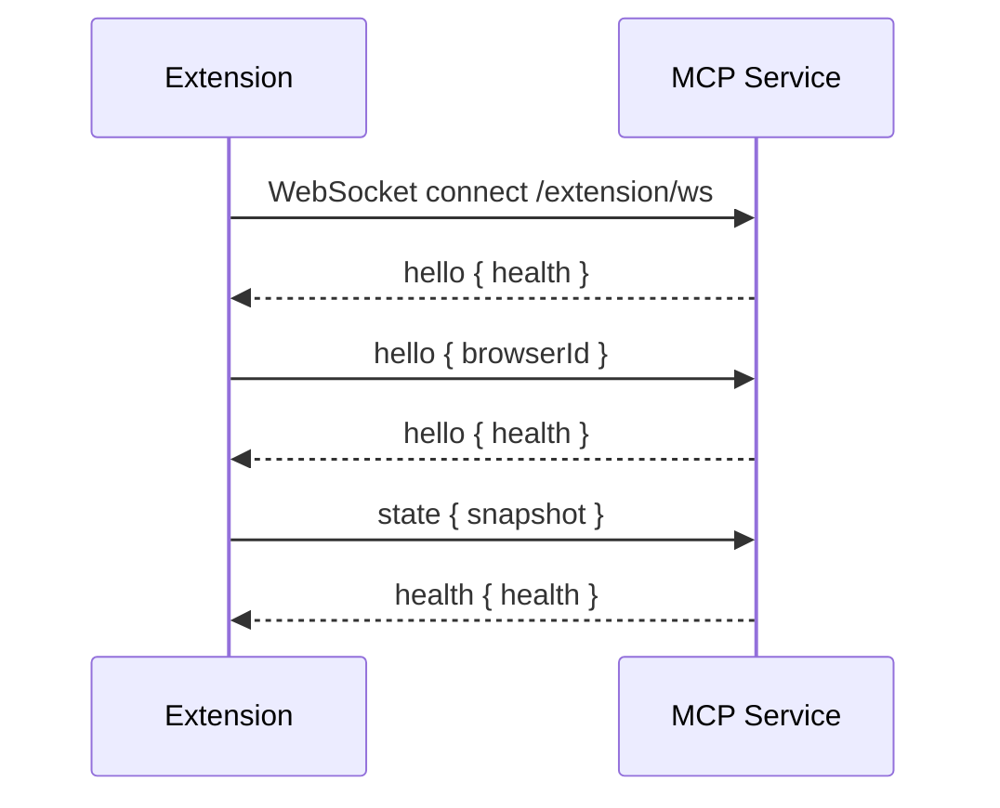
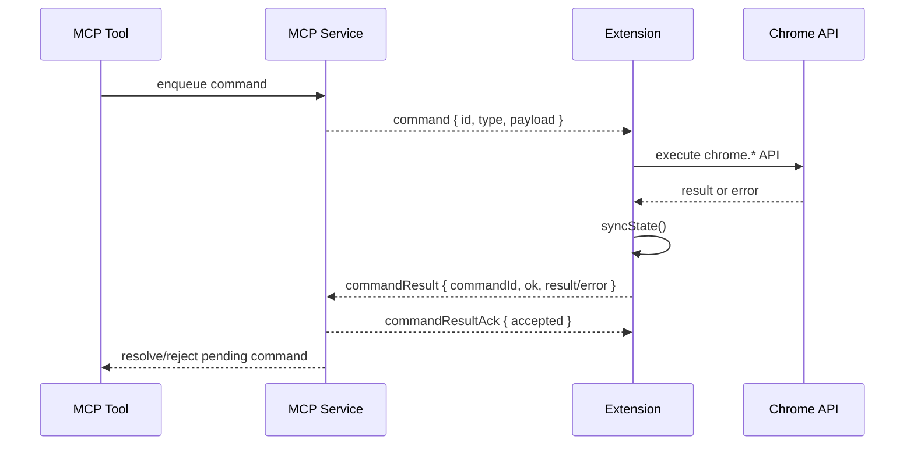
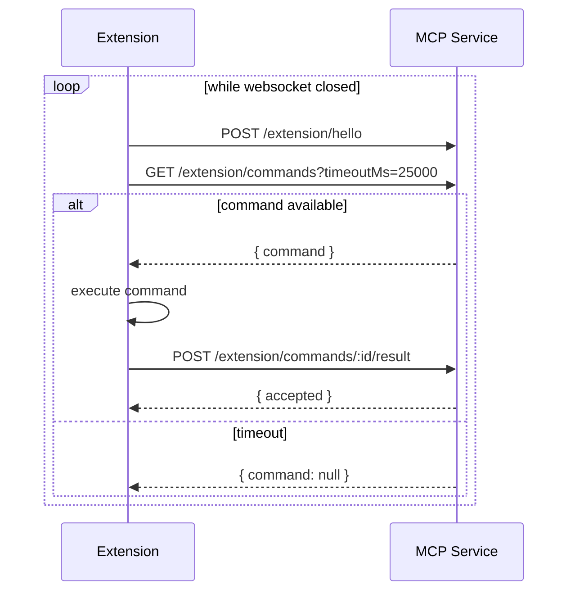

# Chrome Extension Bridge 与 MCP 服务通讯协议

本文定义 Chrome Extension Bridge 与 Browser Control MCP 服务之间的通讯协议。协议用于在 Standard Chrome CDP 无法完整提供浏览器 UI 空间模型时，由扩展向 MCP 服务上报 tabs/windows/tabGroups 状态，并接收 MCP 服务下发的浏览器 UI、书签、历史命令。

## 1. 协议目标

- 让 MCP 服务获得标准 Chrome 中真实的 tab/window/tab group 模型。
- 建立 `tabId <-> targetId` 映射，使 CDP 页面自动化和 Chrome UI 状态可以合并。
- 让 MCP 服务通过扩展执行 Chrome Extension API 命令。
- 使用 WebSocket 保持实时交互。
- 保留 HTTP 长轮询作为 fallback。
- 支持扩展 service worker 休眠、重启、断线重连后的状态恢复。

## 2. 角色

| 角色 | 说明 |
| --- | --- |
| Chrome Extension Bridge | MV3 扩展，运行在 Chrome 内部，调用 `chrome.*` API |
| MCP Bridge Service | Browser Control MCP 进程内的 bridge endpoint 和 `ChromeExtensionBridge` store |
| CDP Connection | MCP 服务连接到同一 Chrome 实例的 CDP WebSocket |
| MCP Tools | tabs/windows/tab_groups/bookmarks/history 等工具调用方 |

## 3. 传输通道

### 3.1 WebSocket 主通道

扩展连接：

```text
ws://<mcp-host>:<mcp-port>/extension/ws
```

WebSocket 是主通道，用于：

- 扩展发送 hello、ping、state、commandResult。
- MCP 服务发送 hello、pong、health、command、commandResultAck、error。

### 3.2 HTTP fallback 通道

当 WebSocket 未连接时，扩展使用 HTTP endpoint：

| 方法 | 路径 | 方向 | 说明 |
| --- | --- | --- | --- |
| `POST` | `/extension/hello` | Extension -> MCP | 注册/刷新 browserId |
| `POST` | `/extension/state` | Extension -> MCP | 上报完整状态快照 |
| `GET` | `/extension/health` | Client -> MCP | 查询 bridge 健康状态 |
| `GET` | `/extension/commands?timeoutMs=25000` | Extension -> MCP | 长轮询等待命令 |
| `POST` | `/extension/commands/:id/result` | Extension -> MCP | 回传命令执行结果 |

HTTP fallback 与 WebSocket 的消息语义一致，但命令拉取由扩展主动轮询完成。

## 4. 数据格式

所有 WebSocket 消息和 HTTP body 均使用 JSON。

所有 WebSocket 消息必须包含：

```ts
interface BridgeMessage {
  type: string
  [key: string]: unknown
}
```

未知 `type`：

- MCP 服务返回 `{ type: "error", error: "Unknown message type: ..." }`。
- 扩展端记录 warning，不中断连接。

## 5. 标识

### 5.1 `browserId`

`browserId` 是扩展生成并保存在 `chrome.storage.local` 的浏览器实例标识，用于诊断和识别扩展来源。

特征：

- 字符串。
- 同一 Chrome profile 内保持稳定。
- 扩展重启后复用。
- 不作为安全认证凭据。

### 5.2 `sequence`

`sequence` 是扩展状态快照序号。

特征：

- 数字。
- 每次 `syncState()` 增加。
- MCP 服务记录最近序号，用于诊断状态是否更新。
- 当前协议不强制丢弃旧序号，但后续可扩展为乱序保护。

### 5.3 `tabId`

来自 `chrome.tabs.Tab.id`。它是 Chrome 对真实 tab 的稳定整数标识。

### 5.4 `targetId`

来自 `chrome.debugger.getTargets()` 返回的 `TargetInfo.id`。它是 CDP target 标识，用于与 MCP 服务的 CDP `Target.getTargets()` 合并。

注意：

- `targetId` 是不透明字符串。
- 页面生命周期变化可能导致 targetId 变化。
- 扩展每次全量快照前刷新映射。

## 6. WebSocket 消息：Extension -> MCP

### 6.1 `hello`

扩展连接建立后发送。

```ts
interface HelloMessage {
  type: 'hello'
  browserId?: string
}
```

示例：

```json
{
  "type": "hello",
  "browserId": "bridge-6dfb6ddf"
}
```

MCP 响应：

```ts
interface HelloAckMessage {
  type: 'hello'
  health: BridgeHealth
}
```

### 6.2 `ping`

扩展用于刷新在线状态。

```ts
interface PingMessage {
  type: 'ping'
  browserId?: string
}
```

MCP 响应：

```ts
interface PongMessage {
  type: 'pong'
  health: BridgeHealth
}
```

### 6.3 `state`

扩展上报完整浏览器状态快照。

```ts
interface StateMessage {
  type: 'state'
  snapshot: BridgeStateSnapshot
}
```

兼容形式：如果消息本身没有 `snapshot` 字段，MCP 服务也可以把整个消息按 `BridgeStateSnapshot` 解析。

MCP 响应：

```ts
interface HealthMessage {
  type: 'health'
  health: BridgeHealth
}
```

### 6.4 `commandResult`

扩展执行 MCP 命令后回传结果。

```ts
interface CommandResultMessage {
  type: 'commandResult'
  commandId: string
  ok: boolean
  result?: unknown
  error?: string
}
```

成功示例：

```json
{
  "type": "commandResult",
  "commandId": "8d971bb5",
  "ok": true,
  "result": {
    "tabId": 123
  }
}
```

失败示例：

```json
{
  "type": "commandResult",
  "commandId": "8d971bb5",
  "ok": false,
  "error": "No tab with id: 123"
}
```

MCP 响应：

```ts
interface CommandResultAckMessage {
  type: 'commandResultAck'
  commandId: string
  accepted: boolean
}
```

`accepted=false` 表示 MCP 服务已无对应 pending command，常见原因：

- 命令已超时。
- MCP 服务重启。
- 扩展重复发送了结果。

## 7. WebSocket 消息：MCP -> Extension

### 7.1 `hello`

MCP 在新连接建立后主动发送一次当前 health。

```ts
interface ServerHelloMessage {
  type: 'hello'
  health: BridgeHealth
}
```

### 7.2 `pong`

响应扩展 `ping`。

```ts
interface PongMessage {
  type: 'pong'
  health: BridgeHealth
}
```

### 7.3 `health`

响应扩展 `state`。

```ts
interface HealthMessage {
  type: 'health'
  health: BridgeHealth
}
```

### 7.4 `command`

MCP 服务向扩展下发 Chrome API 命令。

```ts
interface CommandMessage {
  type: 'command'
  command: BridgeCommand
}

interface BridgeCommand {
  id: string
  type: string
  payload?: Record<string, unknown>
}
```

示例：

```json
{
  "type": "command",
  "command": {
    "id": "8d971bb5",
    "type": "tabs.activate",
    "payload": {
      "tabId": 123
    }
  }
}
```

### 7.5 `commandResultAck`

确认命令结果是否被 MCP 接受。

```ts
interface CommandResultAckMessage {
  type: 'commandResultAck'
  commandId: string
  accepted: boolean
}
```

### 7.6 `error`

MCP 服务无法解析或处理消息时返回。

```ts
interface ErrorMessage {
  type: 'error'
  error: string
}
```

## 8. 状态快照 schema

### 8.1 `BridgeStateSnapshot`

```ts
interface BridgeStateSnapshot {
  sequence?: number
  browserId?: string
  tabs?: BridgeTab[]
  windows?: BridgeWindow[]
  groups?: BridgeTabGroup[]
}
```

状态快照是全量快照。扩展不发送增量 patch。

### 8.2 `BridgeTab`

```ts
interface BridgeTab {
  tabId: number
  targetId?: string
  windowId: number
  index: number
  url?: string
  title?: string
  active?: boolean
  pinned?: boolean
  hidden?: boolean
  status?: 'loading' | 'complete'
  groupId?: number
}
```

字段说明：

| 字段 | 说明 |
| --- | --- |
| `tabId` | Chrome tab id |
| `targetId` | CDP target id，来自 `chrome.debugger.getTargets()` |
| `windowId` | Chrome window id |
| `index` | tab 在窗口中的位置 |
| `url` | 当前 URL |
| `title` | 当前标题 |
| `active` | 是否为所在窗口激活 tab |
| `pinned` | 是否固定 |
| `hidden` | Chrome tab hidden 标记 |
| `status` | loading 或 complete |
| `groupId` | Chrome tab group id；无分组时省略 |

### 8.3 `BridgeWindow`

```ts
interface BridgeWindow {
  windowId: number
  type?: string
  focused?: boolean
  state?: 'normal' | 'minimized' | 'maximized' | 'fullscreen'
  tabCount?: number
  activeTabId?: number
  bounds?: {
    left?: number
    top?: number
    width?: number
    height?: number
    windowState?: string
  }
}
```

### 8.4 `BridgeTabGroup`

```ts
interface BridgeTabGroup {
  groupId: number
  windowId: number
  title?: string
  color?: string
  collapsed?: boolean
  tabIds?: number[]
}
```

## 9. Bridge health schema

MCP 服务通过 `/extension/health` 或 WebSocket ack 返回：

```ts
interface BridgeHealth {
  connected: boolean
  lastSeenAt?: number
  ageMs?: number
  sequence: number
  browserId?: string
  pendingCommands: number
  tabs: number
  windows: number
  groups: number
}
```

`connected` 判定：

```text
lastSeenAt > 0 && Date.now() - lastSeenAt <= 60000
```

`connected=false` 不一定表示扩展未安装，也可能是 service worker 休眠、MCP 服务重启或网络通道暂时断开。

## 10. HTTP fallback 协议

### 10.1 `POST /extension/hello`

请求：

```json
{
  "browserId": "bridge-6dfb6ddf"
}
```

响应：

```json
{
  "connected": true,
  "lastSeenAt": 1720000000000,
  "ageMs": 0,
  "sequence": 10,
  "browserId": "bridge-6dfb6ddf",
  "pendingCommands": 0,
  "tabs": 3,
  "windows": 1,
  "groups": 0
}
```

### 10.2 `POST /extension/state`

请求 body 是 `BridgeStateSnapshot`。

响应 body 是 `BridgeHealth`。

### 10.3 `GET /extension/health`

响应 body 是 `BridgeHealth`。

### 10.4 `GET /extension/commands?timeoutMs=25000`

扩展长轮询等待命令。

响应，有命令：

```json
{
  "command": {
    "id": "8d971bb5",
    "type": "tabs.activate",
    "payload": {
      "tabId": 123
    }
  }
}
```

响应，无命令：

```json
{
  "command": null
}
```

`timeoutMs`：

- 默认 25000。
- 服务端限制在 0 到 25000 毫秒之间。

### 10.5 `POST /extension/commands/:id/result`

请求：

```json
{
  "ok": true,
  "result": {
    "tabId": 123
  }
}
```

响应：

```json
{
  "accepted": true
}
```

## 11. 命令类型

### 11.1 tabs

#### `tabs.create`

payload：

```ts
{
  url?: string
  active?: boolean
  windowId?: number
}
```

result：

```ts
{
  tabId?: number
}
```

#### `tabs.close`

payload：

```ts
{
  tabId: number
}
```

result：

```ts
{}
```

#### `tabs.activate`

payload：

```ts
{
  tabId: number
}
```

result：

```ts
{}
```

#### `tabs.move`

payload：

```ts
{
  tabId: number
  windowId?: number
  index?: number
}
```

result：

```ts
{
  tabId?: number
}
```

#### `tabs.duplicate`

payload：

```ts
{
  tabId: number
}
```

result：

```ts
{
  tabId?: number
}
```

#### `tabs.pin`

payload：

```ts
{
  tabId: number
  pinned: boolean
}
```

result：

```ts
{
  tabId?: number
}
```

### 11.2 windows

#### `windows.create`

payload：

```ts
{}
```

result：

```ts
{
  windowId?: number
}
```

#### `windows.close`

payload：

```ts
{
  windowId: number
}
```

#### `windows.activate`

payload：

```ts
{
  windowId: number
}
```

#### `windows.setVisibility`

payload：

```ts
{
  windowId: number
  visible: boolean
  activate?: boolean
}
```

Chrome 实现说明：

- `visible=true` 映射为 `chrome.windows.update(windowId, { state: 'normal' })`。
- `visible=false` 映射为 `state: 'minimized'`。

### 11.3 tab groups

#### `tabGroups.create`

payload：

```ts
{
  tabIds: number[]
  title?: string
}
```

result：

```ts
{
  groupId?: number
}
```

#### `tabGroups.add`

payload：

```ts
{
  groupId: number
  tabIds: number[]
}
```

#### `tabGroups.update`

payload：

```ts
{
  groupId: number
  title?: string
  color?: string
  collapsed?: boolean
}
```

#### `tabGroups.ungroup`

payload：

```ts
{
  tabIds: number[]
}
```

#### `tabGroups.close`

payload：

```ts
{
  groupId: number
  tabIds?: number[]
}
```

扩展实现会关闭 `tabIds` 中的 tabs。

### 11.4 bookmarks

#### `bookmarks.list`

payload：

```ts
{
  folderId?: string
}
```

result：

```ts
{
  nodes: BookmarkNode[]
}
```

#### `bookmarks.search`

payload：

```ts
{
  query: string
  maxResults?: number
}
```

result：

```ts
{
  results: BookmarkNode[]
}
```

#### `bookmarks.create`

payload：

```ts
{
  title: string
  url?: string
  parentId?: string
  index?: number
}
```

省略 `url` 时创建文件夹。

#### `bookmarks.update`

payload：

```ts
{
  id: string
  title?: string
  url?: string
}
```

#### `bookmarks.move`

payload：

```ts
{
  id: string
  parentId?: string
  index?: number
}
```

#### `bookmarks.remove`

payload：

```ts
{
  id: string
}
```

实现使用 `chrome.bookmarks.removeTree(id)`，因此删除文件夹会删除整个子树。

### 11.5 history

#### `history.search`

payload：

```ts
{
  query: string
  maxResults?: number
  startTime?: number
  endTime?: number
}
```

result：

```ts
{
  entries: HistoryEntry[]
}
```

#### `history.recent`

payload：

```ts
{
  maxResults?: number
}
```

#### `history.deleteUrl`

payload：

```ts
{
  url: string
}
```

#### `history.deleteRange`

payload：

```ts
{
  startTime: number
  endTime: number
}
```

## 12. 资料对象 schema

### 12.1 `BookmarkNode`

```ts
interface BookmarkNode {
  id: string
  parentId?: string
  index?: number
  title: string
  url?: string
  type: 'url' | 'folder'
  dateAdded: number
  dateLastUsed?: number
}
```

### 12.2 `HistoryEntry`

```ts
interface HistoryEntry {
  id: string
  url: string
  title: string
  lastVisitTime: number
  visitCount: number
  typedCount: number
}
```

时间单位：

- `dateAdded`
- `dateLastUsed`
- `lastVisitTime`
- `startTime`
- `endTime`

均使用毫秒级 Unix epoch。

## 13. 时序

### 13.1 WebSocket 连接与快照



### 13.2 命令执行



### 13.3 HTTP fallback 长轮询



## 14. 重连与超时

扩展：

- WebSocket 断开后 2000ms 重连。
- HTTP polling 失败后 2000ms 重试。
- WebSocket 打开时暂停 HTTP command polling 的实际拉取。
- 每次命令后调用 `syncState()`，无论成功或失败。
- lifecycle event 触发 debounced `syncState()`，debounce 时间为 150ms。

MCP 服务：

- command timeout 为 10000ms。
- bridge stale threshold 为 60000ms。
- WebSocket 新连接会替换旧连接。
- 旧连接被关闭时，如果仍是 active socket，则清除 command sender。

## 15. 一致性策略

### 15.1 全量快照优先

扩展使用生命周期事件作为触发器，但不把事件本身当作状态源。每次同步都重新查询：

- `chrome.tabs.query({})`
- `chrome.windows.getAll({ populate: true })`
- `chrome.tabGroups.query({})`
- `chrome.debugger.getTargets()`

然后生成完整 snapshot。

### 15.2 命令后同步

每个命令执行后立即尝试同步状态。这样 MCP tool 能尽快看到新 tab/window/group/bookmark/history 结果。

### 15.3 target 映射刷新

每个 snapshot 都刷新 `tabId -> targetId`。MCP 服务应以最新 snapshot 为准。

## 16. 错误处理

### 16.1 扩展执行错误

扩展捕获异常并返回：

```json
{
  "type": "commandResult",
  "commandId": "8d971bb5",
  "ok": false,
  "error": "..."
}
```

MCP 服务将 pending command reject，最终 MCP tool 返回错误结果。

### 16.2 命令超时

MCP 服务 10 秒内未收到 result，则 pending command 超时：

```text
Extension command timed out: <type>
```

如果扩展之后才返回 result，ack 会是：

```json
{
  "type": "commandResultAck",
  "commandId": "...",
  "accepted": false
}
```

### 16.3 未知命令

扩展收到未知 `command.type` 时抛出错误：

```text
Unknown command type: <type>
```

并通过 `commandResult.ok=false` 返回。

### 16.4 未知消息

MCP 服务收到未知 WebSocket `message.type` 时返回 `error`。

## 17. 安全要求

当前协议面向本机开发和本机 MCP 场景。

要求：

- MCP 服务只监听本地可信地址。
- 扩展 host permission 仅允许 localhost/127.0.0.1。
- 不把 `browserId` 当作认证凭据。
- 不从网页内容接受 bridge 指令。
- 删除书签、删除历史等操作必须由 MCP tool/prompt 层约束。

建议后续增强：

- 增加短期 pairing token。
- WebSocket URL 附带 token。
- HTTP fallback 请求携带 token header。
- MCP 服务校验 Extension Origin。
- 校验 CDP target 列表和扩展 snapshot 是否来自同一浏览器实例。

## 18. 兼容性

协议兼容策略：

- 新字段应保持 optional。
- 消息 `type` 不变时，不改变已有字段语义。
- 新命令通过新增 `command.type` 扩展。
- 扩展不识别的命令返回错误，不应静默忽略。
- MCP 服务不识别的消息返回 `error`。

## 19. 版本建议

当前实现未显式携带 protocol version。建议后续增加：

```ts
interface HelloMessage {
  type: 'hello'
  browserId?: string
  protocolVersion?: '1'
  extensionVersion?: string
}
```

MCP 服务可据此做能力协商：

```ts
interface BridgeCapabilities {
  tabs: boolean
  windows: boolean
  tabGroups: boolean
  bookmarks: boolean
  history: boolean
  debuggerTargets: boolean
}
```

## 20. 调试

常用检查：

```bash
curl http://127.0.0.1:3100/extension/health
curl http://127.0.0.1:3100/health
```

健康状态中重点看：

- `extensionBridge.connected`
- `extensionBridge.sequence`
- `extensionBridge.tabs`
- `extensionBridge.windows`
- `extensionBridge.groups`
- `extensionBridge.pendingCommands`

扩展 Options 页应显示当前 MCP server URL 和连接状态。
